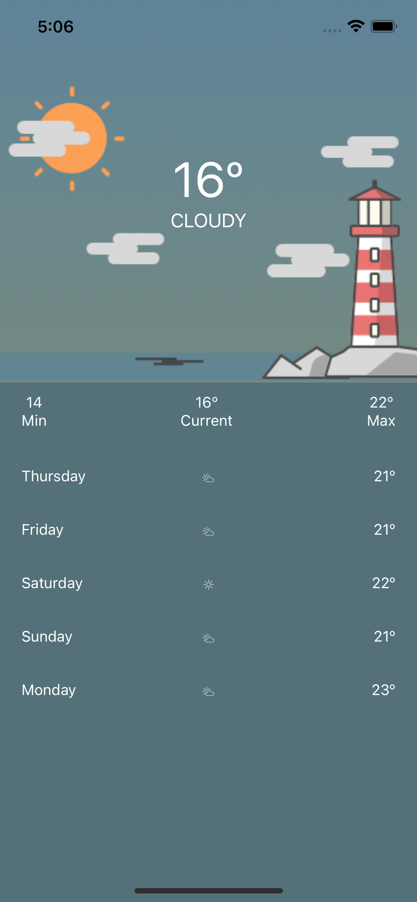

# React Native: Take home assessment notes

# Setup

## Libraries

I added the following additional libraries:

- Styled Components
- @react-native-community/geolocation
- React native testing library
- Typescript

## Organization

The application has been organized along a few folders all in the `src` folder

- Assets. Where images and icons are stored
- Screens. Where individual screens are stored
- Components. Reusable interfaces
- hooks. Where services and state management is contained
- types. Typescript documentation of types used by functions
- configuration: Mock storage of `environment` variables
- utils: Reusable functions

## Tests

Test have been implemented using the `React Native Testing Library`

There are `__tests__` folders next to components that store tests which are named according to the file being tested

# Improvements

Here are things that i believe I could have done better or improved.

- Usage of a global state management library for consistency
- Implementation of env to store data such as API endpoints
- More extensive tests across the whole app

## Setup issues

I ran into an issue enforcing types on the styled component theme. Intellisense is therefore not available when setting styles using the global theme. 

